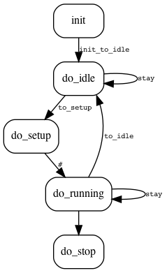

# GV_FSM [](https://badge.fury.io/rb/gv_fsm)

This is a Ruby gem and executable for generating a stub for a Finite State Machine in C/C++ from a scheme written in Graphviz language.

## Installation

Simply:

```sh
[sudo] gem install gv_fsm
```

**Warning**: if you are using [rvm](https://rvm.io) or similar tools, the executable is installed in the rvm hidden folders: find where it is with `gem environment` **be sure to have the path for EXECUTABLE DIRECTORY it in your path!**

## Usage

First, you have to create a Graphviz .dot file describing the state machine. Use **directed edges** for transition and follow these conventions:

* States are represented by nodes. Node labels are taken as name of functions called within a state.
* If the state label is missing, the function is generated with the signature `state_t do_<statename>(state_data_t *data)`
* All persistent state data have to be put in the `data` object (typically a C struct)
* `state_data_t` is typedef as `void`: either cast it within each state and transition function, or edit the typedef at the beginning of the header.
* Transitions may have associated functions: if an edge (transition) label is missing, no transition function is generated. If it is present, then the label becomes the name of the function; if the lable is the `#` character, the function is generated with the signature `void <source_state>_to_<dest_state>()`
  
The .dot file can be used for generating C/C++ files with the command:

```sh
gv_fsm scheme.dot
```

This generates a header file (by default with the name `scheme.h`, use the `-s` switch for changing it) and the source file (`scheme.c`). Typically, **you have then to provide the implementation of state and transition functions by only editing the `scheme.c` file**.

The main interface to the FSM in C is the `run_state` function. See at the end of the generated source file for example usage.

## Arduino support

If you need an FSM for your Arduino, you can generate it with the command option `--ino`: this will generate a `.h` and a `.cpp` files, omitting all instructions that are not available on the Arduino (e.g. the `syslog` calls, which are replaced with `Serial.print calls`). Load these files in the IDE, require the header from the main `.ino` file, and call the FSM manager function from within the main `loop()` function.

## Example

See the `sm.dot` file as FSM example, and the generated files `example.{c,h}`. In this example, the same function `stay` is generated from both transitions from idle to idle and from running to running. Also, the name of the transition from setup to running is automatically generated (as `setup_to_running`).
The files `arduino.{cpp,h}` are the corresponding examples generated for the Arduino platform.


